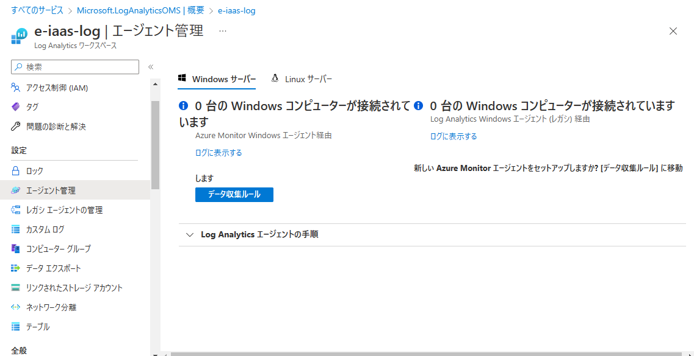
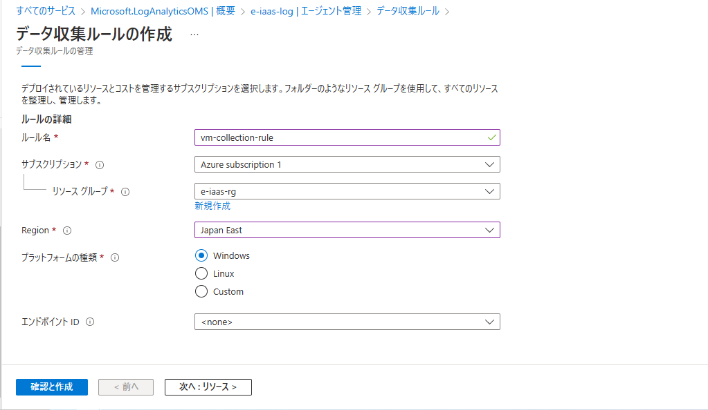
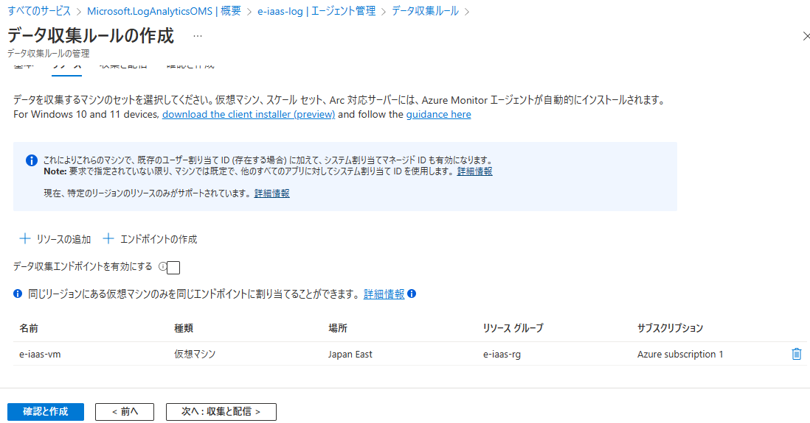
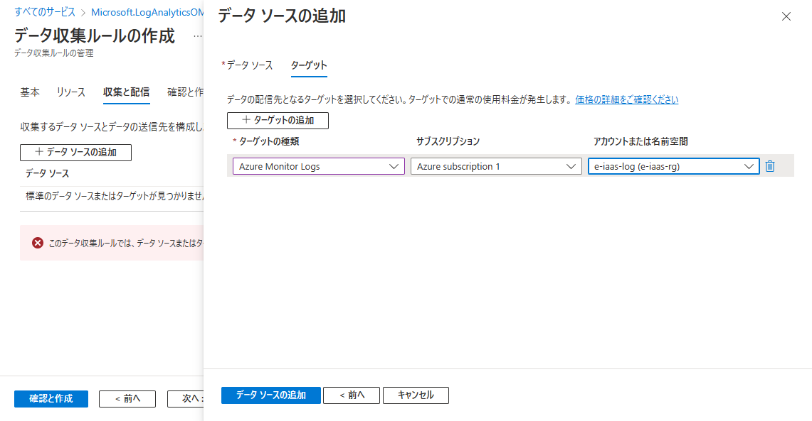
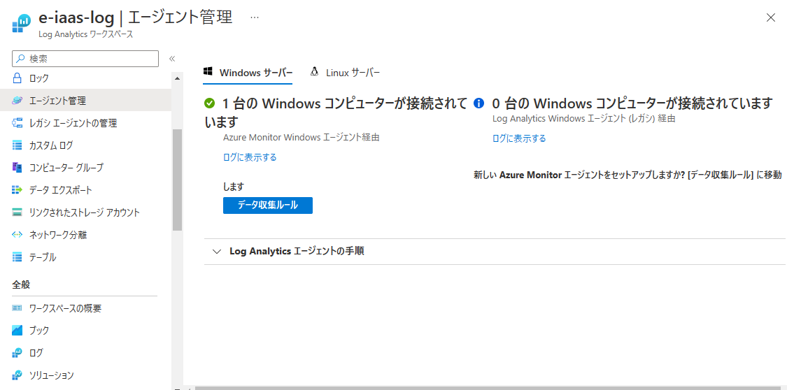
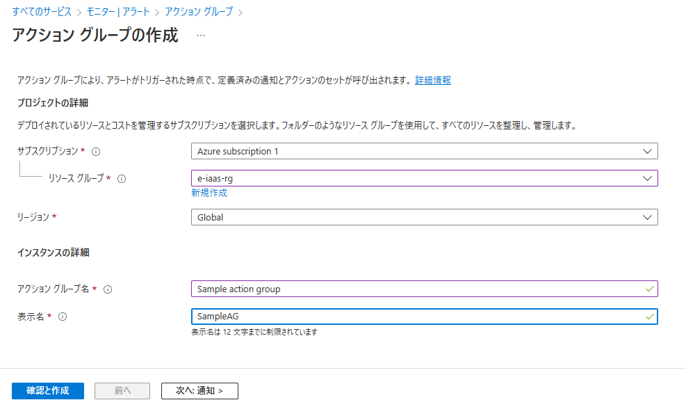
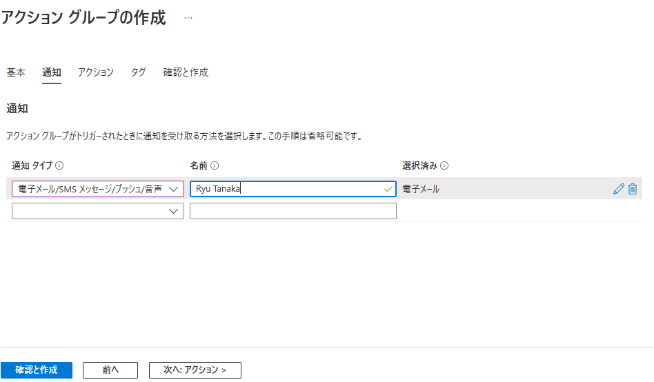
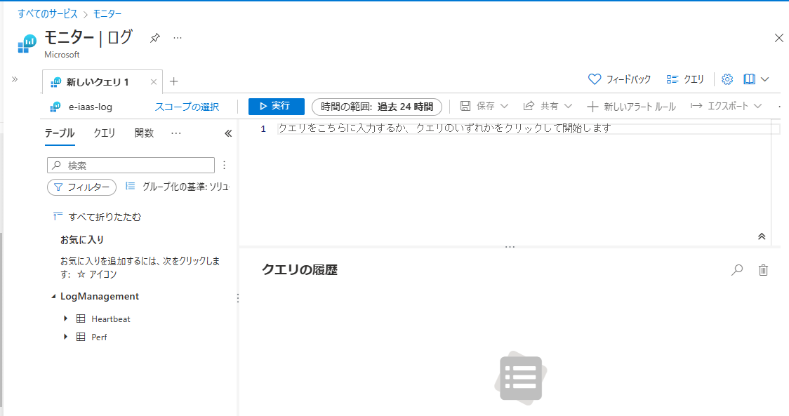

# Azure Monitorとは  

複数のサービスを一つに統合したもの  
 - log Analytics  
 - アラート  
 - Network Watcher  
 - Application Insights  
 - サービス正常性  

# Auzre Monitorの構成手順  

 1. Log Analyticsワークスペースを作成する。  
 2. データ収集ルールを作成する。  
    →何をどこから収集してどこに保存するかを設定  
 3. アクショングループを登録する。  
 4. アラートルールを登録する。  

### 1. Log Analyticsワークスペースを作成する。  

全てのサービス > モニター > Log Analyticsワークスペースを開く。作成ボタンから新規作成  !
  

リージョン、インスタンスの名前を入れたら作成を行い、リソースへ移動する。  

### 2. データ収集ルールを作成する。  

（仮想インスタンスは起動状態から始める）  
メニューからエージェント管理を選択し、データ収集ルールボタンを押す。
  

新規作成には作成ボタンを押し、以下のように設定し次へいく  
  

リソースでは、監視対象のVMを選択する。  
  

収集と配信では、VMから何を取得してどこに配置するかを指定します。  
ターゲットで先ほど作成したワークスペースを選択すること。  
  

終わったら作成し、エージェント管理画面から1台のVMが接続されていることを確認する。  
  

### 3. アクショングループを登録する。  

左のメニューからモニター > アラート > アクショングループタブを押す。  
新規作成を行う。  
  

通知では、通知先のメールアドレスを登録する。  
  

アクションでは、Webhookなど設定できるが、今回は行わないのでそのままアクショングループを作成する。  

### 4. アラートルールを登録する。(死活監視)  

モニター > ログ の画面からKQLを使って、登録を行う。  
  
