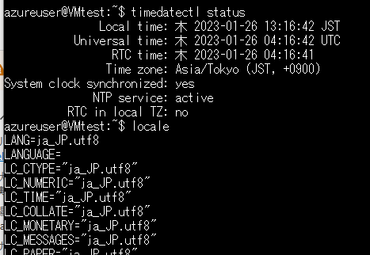

#  Azure Service Catalog Based ApplicationでVMを作成してみる  

二つのJSONを作成してVM(仮想マシン)作成画面を作成する。  
それぞれのJSONの概要説明は以下である。  

〇mainTemplate.json  
```
VMがどういう設定で作成されるかを記載するJSON。
createUiDefinition.jsonでoutputされた値を引き継いで、各設定項目に埋め込みVMを作成する。
```
〇createUiDefinition.json
```
UI画面の構成を設定できる。（HTMLとかのイメージ）
また、画面で入力された項目をmainTemplate.jsonにoutputする。
```  

mainTemplate.json作成時の[リファレンス])(https://learn.microsoft.com/ja-jp/azure/azure-resource-manager/templates/syntax)  
リファレンスはあるが、1から全てを作成するのは大変なのでVMを作る場合であれば、実際に仮想マシンのポータルから  
各設定値を入力して、最後作成確認画面からJSONをダウンロードできるので、それを使うと楽。  


```JSON
 "parameters": {
      "storageAccountNamePrefix": {
        "type": "string",
        "maxLength": 11,
        "metadata": {
          "description": "Storage prefix must be maximum of 11 characters with only lowercase letters or numbers."
        }
      },
      "storageAccountType": {
        "type": "string"
      },
      "location": {
        "type": "string",
        "defaultValue": "[resourceGroup().location]"
      }
    }
```

### parameters部分の説明  
3つのパラメータを定義（3つの変数を作っているイメージ）  
- storageAccountNamePrefix  
- storageAccountType  
- location  

テンプレート内で使用される関数の[リファレンス](https://learn.microsoft.com/ja-jp/azure/azure-resource-manager/templates/template-functions)  

例えば、「concat」という関数は  
複数の配列を結合し、連結された文字列を返す。または複数の文字列を連結し、連結文字列を返す関数である。  


# createUiDefinition.json  

リファレンスは[こちら](https://learn.microsoft.com/ja-jp/azure/azure-resource-manager/managed-applications/create-uidefinition-elements)  

createUiDefinition.jsonを作るときに参考になりそうな[Azure機能](https://portal.azure.com/?feature.customPortal=false#view/Microsoft_Azure_CreateUIDef/SandboxBlade)  

Virtual Machinのリソース部分の書き方は[こちら](https://learn.microsoft.com/ja-jp/azure/templates/microsoft.compute/2022-08-01/virtualmachinescalesets/virtualmachines?pivots=deployment-language-arm-template)  

ひとまずVMの名前だけを設定して、VM作成が行えるUIの作成は出来た。  
[mainTemplate.json](./file_makeVM/%E6%93%8D%E4%BD%9C1%E3%81%A4%E3%81%AEVM%E4%BD%9C%E6%88%90%E7%94%BB%E9%9D%A2/mainTemplate.json)  
[createUiDefinition.json](./file_makeVM/%E6%93%8D%E4%BD%9C1%E3%81%A4%E3%81%AEVM%E4%BD%9C%E6%88%90%E7%94%BB%E9%9D%A2/createUiDefinition.json)  


# VMを2台作成して、ElasticsearchとFilebeatを連携させる  

## 習得する技術要素  

1. VM作成時にElasticsearch等をインストールする方法  
2. VM作成画面で2つのVMを立ち上げる方法  

## 1. VM作成時にElasticsearch等をインストールする方法  

☆ヒントになりそうなサイト  
https://www.tama-negi.com/2021/12/26/azure-vm-custom-data/  

外部からssh接続できるLinuxコンピュータを起動する。  
  

まず、簡単なFilebeatからインストールしてみる。  
(今回はubuntuを指定)  
[Filebeatダウンロードリファレンス](https://www.elastic.co/guide/en/beats/filebeat/7.17/setup-repositories.html#_apt)  
以下のコマンドを実行することで、Filebeatのインストールまでが完了する。  
```
wget -qO - https://artifacts.elastic.co/GPG-KEY-elasticsearch | sudo apt-key add -
sudo apt-get install apt-transport-https
echo "deb https://artifacts.elastic.co/packages/7.x/apt stable main" | sudo tee -a /etc/apt/sources.list.d/elastic-7.x.list
sudo apt-get update && sudo apt-get install filebeat
```
これをVM作成時に自動で実行できるようにするためには...  

まず、☆参考サイトにある通り、timezoneとlocaleの設定を行ってみる。  
VM作成時、カスタムデータの欄に以下のように入力する。  
```
#cloud-config
timezone: Asia/Tokyo
locale: ja_JP.utf8
```
入力後、VMの設定を確認すると、上記で設定した通りになっているのがわかる。  
  

カスタムデータの欄にFilebeatのインストール手順を書けば、ＶＭデプロイ時に実行出来そう  
カスタムデータの欄にどのように記載するか、Localeの場合は[こちら](https://cloudinit.readthedocs.io/en/latest/reference/modules.html#locale)  

ただ、参考サイトにある  
```
#cloud-config
timezone: Asia/Tokyo
locale: ja_JP.utf8
package_upgrade: true
packages:
– httpd
runcmd:
– sudo systemctl start httpd
– sudo systemctl enable httpd
```
こちらを実行しても、httpdのインストールはうまくいかなかった。  

ubuntuにはrenameパッケージがデフォルトで入っていないため
```
#cloud-config
package_upgrade: true
runcmd:
  - sudo apt-get update
  - sudo apt install rename
```
こちらを実行しても、renameのインストールはされなかった。  
runcmdの[リファレンス](https://cloudinit.readthedocs.io/en/latest/reference/modules.html#runcmd)  

書き方の問題なのかもしれないので、一応以下も試したが、ダメだった。  
```
#cloud-config
package_upgrade: true
runcmd:
  - [sudo apt-get update]
  - [sudo apt install rename]
```

package_update: trueかなとも思い、入れて試したけど、ダメだった。  

### chatGPTのやり方に従ってみる  
三回聞き直したら、以下の記載で出来た。（笑）  
```
#!/bin/bash

curl -L -O https://artifacts.elastic.co/downloads/beats/filebeat/filebeat-7.11.1-amd64.deb
sudo dpkg -i filebeat-7.11.1-amd64.deb
sudo systemctl enable filebeat
```
```
#!/bin/bash

curl -L -O https://artifacts.elastic.co/downloads/beats/filebeat/filebeat-7.17.8-amd64.deb
sudo dpkg -i filebeat-7.17.8-amd64.deb
sudo systemctl enable filebeat
```

### ElasticsearchとKibanaを入れてみる  
kibana  
```
#!/bin/bash

curl -L -O https://artifacts.elastic.co/downloads/kibana/kibana-7.17.8-amd64.deb
sudo dpkg -i kibana-7.17.8-amd64.deb
sudo systemctl enable kibana
```

Elasticsearch  
```
#!/bin/bash

curl -L -O https://artifacts.elastic.co/downloads/elasticsearch/elasticsearch-7.17.8-amd64.deb
sudo dpkg -i elasticsearch-7.17.8-amd64.deb
sudo systemctl enable elasticsearch
```


## 2. VM作成画面で2つのVMを立ち上げる方法  

思いつくのは、  
〇ElasticsearchとFilebeatが入ったストレージを用意しといて  
　VM作成時に選択...  
〇1度VMを作成した後、もう一度VM作成画面が出る  


