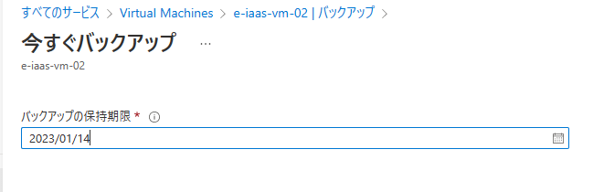

# AzureBackupとは  

スナップショットでのバックアップの問題点  
- ディスク単位で個別にスナップショットを取得しないといけない。  
- 定期的にバックアップをするためには、AzureAutomationなどの別サービスを使用しないといけない。  

AzureBackuoを使えば  
- スケジュールにしたがって、定期的にディスク全体のバックアップをとることができる。  

Azurebackupとは  
- Azureまたはオンプレミスの仮想マシンをバックアップ/リストアすることができる。  
 ・Azureの仮想マシン  
 ・オンプレミスの仮想マシン  
 ・SQLServer（Azureまたはオンプレミス）  
 ・AzurStorageのファイル共有  
- 費用はバックアップする仮想マシンの容量に応じて来ます  
- ローカル冗長ストレージ(LRS)か地理冗長ストレージ(GRL)が選択できる  
  (GRSの場合は保存に対するストレージ費用が2倍となる)
  →メインのリージョンが東日本の場合、サブリージョンの西日本にもバックアップされるため。    

[AzureBackupの費用についてはこちら](https://azure.microsoft.com/ja-jp/pricing/details/backup/)  

AzureBackupの仕組み  
- 仮想マシンに接続されている全てのディスクをバックアップする  
- バックアップを保持するためのストレージを **Recovery Service コンテナ―** という  
- 同一リージョンの仮想マシンをバックアップできる(違うリージョンだとできない)  
- 初回はフルバックアップ、2回目以降は増分のバックアップを行う。  
- 基本的にはスケジュールに従ったバックアップ行うが手動でもバックアップをすることができる。  
  →**オンデマンドバックアップ**  

# AzureBackupの構成  

AzureBackupの構成手順  
1. Recovery Service コンテナ―を作成する  
2. レプリケーションを変更する（GRS→LRS）※バックアップ取得後に変更不可  
3. バックアップポリシーを作成  
   →バックアップのスケジュールなどを決める  
4. バックアップ対象の仮想マシンを登録する  

### 1. Recovery Service コンテナ―を作成する  

ポータル画面 > バックアップセンター > +コンテナ タブを選択  
  

リージョン、コンテナ名を指定して作成する。  
  

### 2. レプリケーションを変更する（GRS→LRS）※バックアップ取得後に変更不可  

コンテナ作成後は、「リソースへ移動」を選択すれば変更画面へ行けるが  
ポータル画面からだと、ポータル画面 > バックアップセンター > コンテナー（左のツリー）> 作成したコンテナを指定  でいける  
  

左のメニューの中から「プロパティ」を選択し、バックアップ更新の下の更新をクリックする  
今回は、確認のためなので、ローカル冗長を選択して保存する  
  

※単語の整理  
**ゾーン** → リージョン内に設置されている独立したインフラの運用区画  
**プライマリーリージョン** → メインで利用するリージョン  
**セカンダリリージョン** → サブで利用するリージョン  

**ローカル冗長（LRS）** → プライマリリージョンの1つのゾーン内にコピーが3つ作成される  
**ゾーン冗長（ZRS）** → プライマリリージョン内の3つのゾーンにそれぞれ1つコピーが作成される  
**geo冗長（GRS）** → プライマリリージョンの1つのゾーンに内にローカルコピーを3つ作成後、セカンダリリージョンに3つをコピー  

セキュリティ設定の下の更新をクリックし、上二つのチェックを外す。  
(バックアップ取得後に変更不可、これが何なのかは後で説明)  
  

### 3. バックアップポリシーを作成  

左のメニューの中から「バックアップポリシー」を選択し、+追加を選択して新規作成する  
ポリシーの種類は「Azure 仮想マシン」を選択  
あとは、ポリシー名や更新頻度を入れて作成する  
  

※ここで **インスタンス リストア** というものが出てくる  
  簡単に言うと、バックアップやリストアの時間を短縮するための仕組み  

  従来のバックアップの仕組みは
  1. スナップショットの取得（一時的にblobストレージに保存される）  
  2. コンテナ―への転送  
  3. blobストレージから削除  

  インスタンス リストアだと  
  1. スナップショットの取得（一時的にblobストレージに保存期間を指定して保存される）  
  2. コンテナ―への転送  
  3. blobストレージから保存期間を過ぎれば削除  

### 4. バックアップ対象の仮想マシンを登録する  

コンテナ―を選択した状態で、左のメニューからバックアップを選択  
  

そのまま、バックアップボタンを押して次に進む  

バックアップポリシーは上で作成したモノを選択  
下の方で、バックアップする仮想マシンも選択する  
最後にバックアップを有効にして、終わり。  
バックアップ対処の仮想マシンは、左メニューのバックアップアイテムから参照できる。  
 

# オンデマンドバックアップの実行(1)  

仮想マシンのメニューにある「バックアップ」を選択すると、バックアップやリストアを実行する画面になる。  
  

オンデマンドバックアップを実行するには、「今すぐバックアップ」を選択する。  
オンデマンドバックアップは、バックアップポリシーとは関係のないため保持期間を指定する。  
  

バックアップが開始されると、トリガーが開始したと通知が来るだけだが、進行状況は  
コンテナ―のバックアップジョブから確認ができる  
  
上の進行中になっているものがオンデマンドバックアップの進行状況です。  
行の右にある詳細表示をクリックすると、詳細情報が見れる。  
AzureBackupに関わる操作の処理結果はバックアップジョブから確認できる。  

# バックアップの保持期限の変更  

オンデマンドバックアップは保持期限を変更できない。  
バックアップポリシーは変更できる。  

